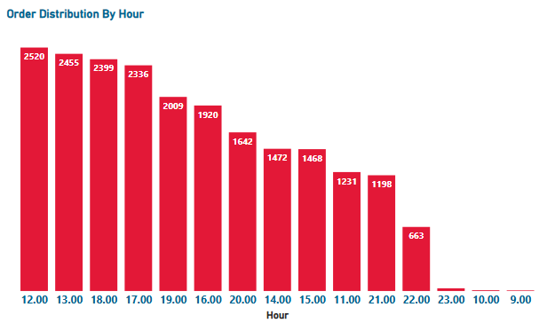
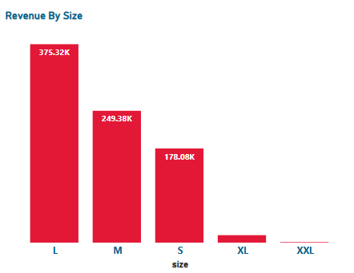
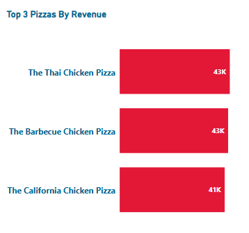

# 🍕 Domino’s Sales Analysis (SQL)

## 📌 Project Overview

This project presents a structured SQL-based exploratory data analysis of Domino’s pizza sales data using PostgreSQL. The analysis focuses on understanding revenue trends, order distribution behavior, product performance, and operational insights.

The objective was to derive business insights from multi-table relational data to support decision-making in sales strategy and operations.

---

## 🗂 Dataset Description

**Source:** Public Domino’s sales dataset (obtained from a GitHub repository associated with the project tutorial)

**Database Used:** PostgreSQL  

**Tables Used (5):**
- `customers`
- `orders`
- `order_details`
- `pizza_types`
- `pizzas`

**Row Counts:**
- Orders: 21,351
- Order Details: 48,621
- Multiple pizza types, categories, sizes, and pricing structures

---

## 🎯 Business Objectives

The analysis was designed to:

- Evaluate month-over-month revenue trends
- Identify peak order hours
- Analyze sales distribution by pizza category
- Evaluate revenue contribution by pizza size
- Identify top-performing pizzas by revenue
- Understand customer purchase behavior patterns

---

## 🛠 Tools & Techniques

- PostgreSQL
- Multi-table Joins
- Aggregations
- GROUP BY & HAVING
- Date/Time Extraction
- Ranking & Sorting
- Revenue Calculations

---

## 🔎 Key Analysis Performed

### 1️⃣ Month-over-Month Sales Trend

- Identified revenue spikes in **March, July, and November**
- Observed dips in **February, September, and December**
- Highlighted seasonal demand fluctuations

---

### 2️⃣ Order Distribution by Hour

- Peak order hour: **12 PM**
- High activity between **12 PM – 10 PM**
- Secondary peaks around 1 PM and 6 PM
- Lowest order volumes during early morning (9 AM–10 AM) and late night (11 PM)

**Insight:** Strong lunch and dinner demand concentration.

---

### 3️⃣ Order Distribution by Category

Category performance (Highest → Lowest):

1. Classic  
2. Supreme  
3. Veggie  
4. Chicken  

**Insight:** Classic pizzas dominate order volume.

---

### 4️⃣ Revenue by Pizza Size

- Highest revenue: **Large size pizzas**
- Lowest revenue: **Double XL size**

**Insight:** Customers prefer standard large sizes over premium large formats.

---

### 5️⃣ Top 3 Pizzas by Revenue

1. Thai Chicken Pizza – ~$43,000  
2. Barbecue Chicken Pizza – ~$43,000  
3. California Chicken Pizza – ~$41,000  

All top performers belong to the **non-vegetarian category**, indicating stronger demand for non-veg offerings.

---

## 📊 Sample Visual Insights

### Month-over-Month Sales


### Order Distribution by Hour


### Revenue by Size


### Top Performing Pizzas


---

## 📂 Repository Structure

```
Dominos-Sales-Analysis-SQL
│
├── sql/
│   └── dominos_sales_analysis.sql
├── presentation/
│   └── Dominos_Sales_Analysis.pdf
├── screenshots/
│   ├── monthly_trend.png
│   ├── orders_by_hour.png
│   ├── revenue_by_size.png
│   └── top_pizzas.png
└── README.md
```

---

## 🚀 Project Outcome

This project demonstrates:

- Strong SQL-based exploratory data analysis
- Ability to work with multi-table relational datasets
- Revenue and performance analysis skills
- Business insight extraction from operational data
- Data storytelling for sales optimization

---

## 👤 Author

**Enos Mohod**  
Aspiring Data Analyst | SQL | Power BI | Python  
Turning sales data into actionable business insights
